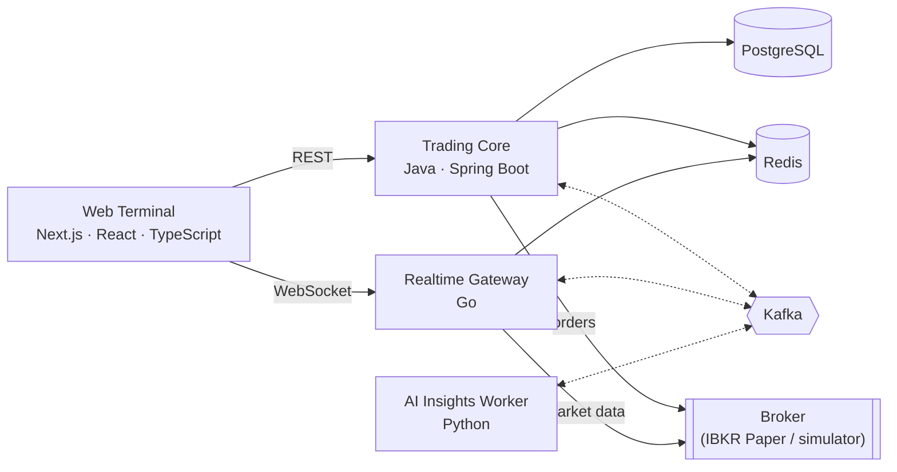

# Real-Time Trading Terminal

A single-page, realtime stock trading terminal with live quotes, live candlestick charts, and paper order execution, built on an event-driven backend.

> **Status: under active development.** The services are being built incrementally. Setup instructions, screenshots, and benchmark results will be added here as each part becomes runnable. Only measured results will be published.

## What it does

- **Live market data:** a watchlist with bid, ask, last, volume, change and change %, streamed over WebSocket, with a visible connection state (`LIVE` / `RECONNECTING` / `STALE` / `DISCONNECTED`). Stale prices are never shown as live.
- **Charting:** Gateway REST candlesticks with bounded refresh, a WebSocket current-price marker, a crosshair, and an interval selector.
- **Trading:** Buy, Sell and Short orders, market and limit order types, open orders, cancellation, and the full order lifecycle, including broker confirmation prompts.
- **Portfolio:** positions, average cost, market value, realized and unrealized P&L, and account metrics. Any metric the broker doesn't provide is shown as *Unavailable*, never estimated.
- **News:** compact, normalized news per selected symbol, with publisher, time, snippets and visible freshness. Public demos use clearly identified synthetic news.

## Runtime modes

| Mode | Purpose |
|---|---|
| `MOCK` | A deterministic market and broker simulator. It needs no credentials and is the only mode used for public demos. |
| `IBKR_PAPER` | Integration with an Interactive Brokers **paper trading** account, for trusted private environments only. |

There is no live-money trading.

## Architecture



| Component | Responsibility |
|---|---|
| **Web Terminal** (Next.js) | The trading UI. It never talks to the broker and holds no secrets. |
| **Trading Core** (Spring Boot) | The system of record for trading: order validation and lifecycle, idempotent order submission, positions and P&L, watchlist, news ingestion, transactional outbox, and reconciliation against the broker |
| **Realtime Gateway** (Go) | Broker session and streaming, quote normalization, per-symbol coalescing and backpressure, browser WebSocket fanout, historical bars, and publishing the broker's order stream to Kafka |
| **AI Insights Worker** (Python) | Asynchronous news enrichment with schema-validated LLM output. It is isolated from trading and cannot place, modify, or cancel orders. |
| **PostgreSQL** | Durable application state |
| **Redis** | Disposable hot state and caches, all with TTLs |
| **Kafka** | Durable asynchronous domain events (orders, executions, broker updates, news) |

### Engineering principles

- **Critical and non-critical paths are separated.** Trading and live quotes never depend on AI, news, or observability.
- **Quotes take a fast path** from broker to gateway to WebSocket to browser. They never go through Kafka or the database.
- **No lost events:** state changes and their events are committed atomically (transactional outbox). Consumers are idempotent, and delivery is at-least-once.
- **No duplicate orders:** order submission is idempotent through `Idempotency-Key`, and orders are never retried automatically.
- **Exact money math:** decimal arithmetic end to end. Prices travel as decimal strings. All timestamps are UTC.
- **Bounded everything:** every queue, buffer, and retry has a limit. Every network call has a timeout, and every external provider is rate-limited.
- **Ports and adapters:** broker and market-data integrations sit behind interfaces, so the simulator and IBKR paper adapters are interchangeable.

## API and event contracts

### News

Open the **News** tab in the trading activity deck to see articles for the selected symbol. MOCK news is fictional,
labelled **Synthetic demo**, and passes through the same normalization, deduplication, PostgreSQL persistence,
Redis cache and transactional event delivery as private provider data. It is not a real company report or a trade signal.

`GET /api/v1/news?symbol=NVDA&limit=20` returns the existing article array, newest first. `X-News-Status` is
`FRESH`, `STALE` or `UNAVAILABLE`; `X-News-Last-Refreshed-At` is the last successful refresh time, including
successful empty results. A temporary provider failure retains usable results; a cold unavailable request returns
a standard 503 problem. News availability does not gate trading or service readiness.

Default Compose fixes `NEWS_PROVIDER=FIXTURE` and does not mount any news credential. Operational settings in
`.env.example` control freshness, retrieval, queue/deadline, provider rate and retention. Additional Core settings
include `NEWS_WORKERS`, `NEWS_MAX_COLD_REQUESTS`, `NEWS_ATTEMPTS`, `NEWS_MAX_RESPONSE_BYTES`, `NEWS_MAX_RECORDS`,
`NEWS_BREAKER_FAILURES`, `NEWS_BREAKER_COOLDOWN` and `NEWS_CLEANUP_INTERVAL`. Bounded cleanup preserves
articles referenced by unpublished outbox records; reaching a storage bound can temporarily stop new ingestion.

**Private personal development only:** Finnhub is an explicit opt-in adapter. First check your account's applicable
personal-use terms and storage permissions. Put the credential in the ignored `secrets/finnhub_api_key` file, then run:

```bash
docker compose -f docker-compose.yml -f infrastructure/news/compose.finnhub-private.yml --profile gateway --profile core --profile web up -d
```

The override enables private development and the trusted-environment guard, requires private/loopback Core CORS
origins and mounts the credential only into Core. Keep the deployment, data volumes and Kafka private. Do not use
private provider data in a public demo. Use separate public MOCK data stores, and delete provider data when your
license or subscription requires it. No paid plan is required by this project. Public live news is deferred until
explicit display/redistribution rights are secured. Preserve publisher attribution and original article links;
attribution alone does not grant redistribution rights. See [Finnhub terms](https://finnhub.io/terms-of-service).

Core publishes normalized new articles to `news.raw.v1` through the existing outbox. The isolated worker publishes
validated interpretations to `news.enriched.v1`; Core accepts the first valid interpretation without automatic replacement.

The REST APIs, the Kafka events and the WebSocket protocol are specified contract-first:
- `contracts/schemas/` holds JSON Schema 2020-12 files, the single source of truth for every message.
- The OpenAPI 3.1 and AsyncAPI 3.1 documents reference those files instead of repeating them.
- Contract tests in Java, Go, Python and TypeScript check that every language accepts and rejects exactly the same golden fixtures, and that serialization keeps decimal prices and large integers exact.

See [`contracts/README.md`](contracts/README.md) and [`tests/contract/README.md`](tests/contract/README.md).

## Technology

Java · Spring Boot · Go · Python · TypeScript · Next.js · React · PostgreSQL · Redis · Apache Kafka (KRaft) · OpenTelemetry · Prometheus · Grafana · Docker Compose

## Getting started

Everything runs with Docker Compose: the local infrastructure (PostgreSQL, Redis, Kafka, the observability stack), the realtime gateway with a simulated market feed, Trading Core with a simulated broker, and the Next.js web terminal.

### Prerequisites

- Docker with **Docker Compose v2.17.0 or newer**
- GNU Make, bash, and curl (on Windows, Git Bash provides bash and curl)

No local Java, Go, Node.js, or Python installation is needed for the infrastructure. Linters and the secret scanner run in pinned containers.

### Quick start

```bash
make up
```

This command:
1. checks the prerequisites;
2. creates `.env` from `.env.example`;
3. generates random local credentials into `./secrets/`, which is git-ignored and never overwritten;
4. starts PostgreSQL, Redis and Kafka, and waits until they are healthy.

To also start Prometheus, Grafana, Tempo and the OpenTelemetry Collector:

```bash
make up-obs
```

To start the complete `MOCK` application and connect a test client to the feed:

```bash
make up-mock
make probe
```

Open the trading terminal at **http://localhost:3000**. It calls Trading Core REST at `http://localhost:18080`, Gateway bars at `http://localhost:18090`, and the Gateway WebSocket at `ws://localhost:18090/ws` directly from the browser. Select a watchlist symbol, wait for a fresh quote, then use the order ticket to place MOCK market or limit orders. The lower deck shows positions, open orders, and executions. The chart's candles come from Gateway REST; its live price marker comes from WebSocket quotes.

The browser URLs are public build-time values (`WEB_CORE_ORIGIN`, `WEB_GATEWAY_ORIGIN`, `WEB_GATEWAY_WS_URL` in `.env`). If host ports change, update these URLs and the exact Core/Gateway browser-origin allowlists, then rebuild the web image. Do not place credentials in web configuration. The terminal has no login and is for the local MOCK workflow; do not expose it publicly without authentication and deployment hardening.

Frontend checks run in the pinned Node container with `make test-web` and `make lint-web`. With `make up-mock` running, `make test-e2e` runs the Playwright MOCK browser workflow. Its test container uses Docker host networking so Chromium can reach the same `localhost` public origins as the terminal; enable host networking in Docker Desktop if needed. The complete `make test` and `make lint` gates include the frontend. The TypeScript client wire types are reproducibly generated from the existing OpenAPI files with `npm run generate:types` in `apps/web`.

The WebSocket endpoint is `ws://127.0.0.1:18090/ws`. For example, send `{"type":"subscribe","symbols":["NVDA","AAPL"]}` from any WebSocket client. Historical bars are at `http://127.0.0.1:18090/api/v1/market/bars?symbol=NVDA&interval=1m&range=1d`.

The Trading Core REST API is at `http://127.0.0.1:18080/api/v1`: orders, confirmations, cancellation, executions, positions, portfolio, watchlist and instrument search. Market orders fill immediately at the live simulated quote, so the symbol must be streaming: keep a WebSocket client subscribed to it, as the terminal does for the symbols on screen. Use a new `Idempotency-Key` UUID for each order, and reuse it only to retry that same order. For example:

```bash
curl -s -X POST http://127.0.0.1:18080/api/v1/orders \
  -H 'Content-Type: application/json' -H "Idempotency-Key: 00000000-0000-4000-8000-000000000001" \
  -d '{"symbol":"NVDA","intent":"BUY","orderType":"LIMIT","quantity":"10","limitPrice":"150.00","timeInForce":"GTC"}'
```

See [the Trading Core README](services/trading-core/README.md) for the order lifecycle and the simulated broker's rules.

To run the gateway on real IBKR **paper** market data through the Client Portal Gateway on your machine (trusted, private environments only), see [the service README](services/ibkr-realtime-gateway/README.md#ibkr-setup-paper-account):

```bash
make ibkr-certs     # per-machine CA and CP Gateway certificate in ./secrets/ibkr
make up-ibkr        # after installing the certificate and logging in to the CP Gateway
make up-ibkr-paper  # also Trading Core on the paper account (set IBKR_PAPER_ACCOUNT_ID in .env; clean database)
make up-ibkr-fake   # the same code path against a fake gateway (no account needed)
```

Public and demo deployments always use `MOCK`.

To put the running feed under load (many clients, subscription churn), with checks that sessions, subscriptions and goroutines are released afterwards:

```bash
make load                                  # 50 clients for 60s
make load LOAD_CLIENTS=200 LOAD_DURATION=10m
```

With both the observability stack and the gateway running (`make up-obs` and `make up-mock`), Grafana shows a **Realtime Gateway** dashboard: connection state, clients, quote rates, coalescing, latency, evictions, Redis health, goroutines and heap.

To check that everything works:

```bash
make verify
```

It tests connectivity, credentials and least-privilege access, Redis ACLs, Kafka produce and consume, and trace ingestion end to end. With the gateway running, it also checks the stream, the metrics endpoint, and the gateway's Redis hot state and bars cache. With Trading Core running, it checks health, migrations, CORS and error handling, that paper mode fails closed outside a trusted environment, and that market orders fill from the live simulated quotes and their domain events reach Kafka and the gateway.

### Services

All ports are published on `127.0.0.1` only. You can change them in `.env`.

Application processes run as non-root where supported. Some official images may briefly start as root during initialization before dropping privileges.

| Service | Address | Notes |
|---|---|---|
| PostgreSQL 18 | `127.0.0.1:15432` | Database `trading`, schema `trading`. Roles: `trading_owner` for schema migrations and `trading_app` for data access only. |
| Redis 8 | `127.0.0.1:16379` | ACL user `app`. No persistence (cache and hot state only). |
| Kafka 4 (KRaft) | `127.0.0.1:19092` | Topic auto-creation is disabled; `kafka-init` provisions `trading.order-events.v1`, `trading.execution-events.v1`, `broker.order-updates.v1` `news.raw.v1`, `news.enriched.v1`, `news.enriched.v1.dlq` and `news.ai-state.v1` |
| Grafana | <http://127.0.0.1:13000> | User `admin`. The password is in `secrets/grafana_admin_password`. |
| Prometheus | <http://127.0.0.1:19090> | |
| Tempo | <http://127.0.0.1:13200> | Trace query API |
| OTLP ingest | `127.0.0.1:14317` (gRPC), `127.0.0.1:14318` (HTTP) | OpenTelemetry Collector |
| Realtime gateway | `ws://127.0.0.1:18090/ws`, `http://127.0.0.1:18090/api/v1/market/bars` | `gateway` profile (`MOCK` by default). Health and Prometheus metrics on `127.0.0.1:18091`. See [the service README](services/ibkr-realtime-gateway/README.md). |
| Trading Core | `http://127.0.0.1:18080/api/v1` | `core` profile (`MOCK`: simulated broker; `IBKR_PAPER` with `make up-ibkr-paper`). Health and Prometheus metrics on `127.0.0.1:18081`. See [the service README](services/trading-core/README.md). |
| Web terminal | <http://127.0.0.1:3000> | `web` profile. Browser trading data comes from Core REST, Gateway bars REST and Gateway WebSocket. |

### Commands

| Command | Description |
|---|---|
| `make up` / `make up-obs` / `make up-mock` | Start the core infrastructure, add the observability stack, or start the complete `MOCK` application (realtime gateway, Trading Core and web terminal) |
| `make probe` | Connect a WebSocket test client to the running feed (`SYMBOLS=NVDA,TSLA QUOTES=10`) |
| `make up-ibkr` / `make up-ibkr-paper` / `make up-ibkr-fake` / `make ibkr-certs` | Run the gateway on IBKR paper market data, add Trading Core on the IBKR paper account, or run the gateway on a fake IBKR gateway for tests; generate the local CP Gateway certificate |
| `make load` | Run load/soak clients against the running feed and check for leaks (`LOAD_CLIENTS=200 LOAD_DURATION=10m`, extra flags via `LOAD_ARGS`) |
| `make verify` | Run the verification checks. `VERIFY_RESTARTS=1 make verify` also proves that PostgreSQL data survives restarts and Redis data doesn't, and that events committed while Kafka is stopped are published once it restarts. |
| `make test-contract` | Run the contract tests in Java, Go, Python and TypeScript against the shared golden fixtures |
| `make test-unit` | Run the Go unit and integration tests of the realtime gateway with the race detector |
| `make test-core` | Run the Trading Core tests: domain, application and architecture tests, and an integration suite against real PostgreSQL and Redis (Testcontainers) that validates every response against the contracts |
| `make test-web` / `make test-e2e` | Run web unit tests, or the Playwright browser workflow against the running MOCK stack |
| `make test` | Run contract, Go, Java and web tests, infrastructure verification and the Playwright browser workflow |
| `make ps` / `make logs [SERVICE=kafka]` | Show container status / follow the logs |
| `make lint` | Validate Compose, shell scripts, Go, Java, web code and API contracts |
| `make security` | Scan git history and every file that would be committed for secrets (gitleaks), and check the Go modules (govulncheck) and the Java dependencies (OSV-Scanner) for known vulnerabilities |
| `make down` | Stop the containers and keep the data |
| `make clean` | Stop the containers and delete all local data volumes (asks for confirmation) |

If a port is already in use, `make up` warns about it. Change the corresponding `*_HOST_PORT` value in `.env`.

## Security

See [SECURITY.md](SECURITY.md). Public deployments run in `MOCK` mode only. Broker credentials never reach the browser, the repository, or logs.

## License

Proprietary: available for viewing and evaluation only. See [LICENSE](LICENSE).
## Informational news insights

The MOCK stack includes an isolated asynchronous worker. Synthetic articles receive clearly labelled synthetic
interpretations through Kafka, validated Core persistence and the existing News tab. Raw news remains available
when the worker is stopped. Refresh news to see newly accepted interpretation. Sentiment and confidence never
drive trading actions; confidence is not a calibrated probability.

Use `make test-ai`, `make eval-ai` and `make lint-ai` for deterministic worker checks. `make security` includes
the Python dependency audit. No test invokes an external model.

The optional private OpenAI override in `infrastructure/ai/compose.openai-private.yml` is fail-closed and requires
separately verified content-processing rights, model reproducibility, a server credential file, an approved budget
and an operator-managed restricted proxy reachable from the isolated worker network. Default spend is zero.
Never add an unrestricted network or trading-service route to make that deployment work. Public MOCK requires
neither a proxy nor a model credential. Historical reenrichment and automatic insight replacement are unsupported.
