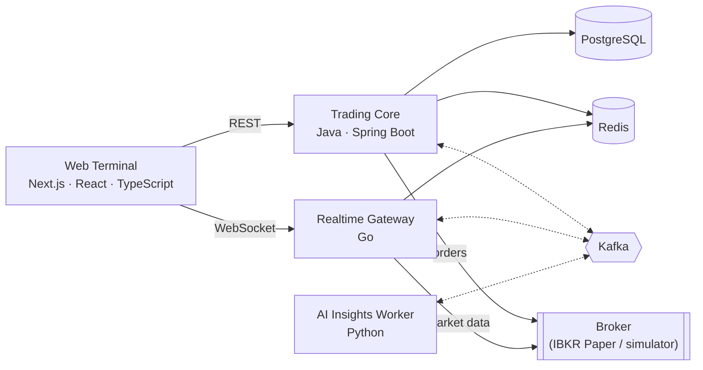

# Real-Time Trading Terminal

A single-page, realtime stock trading terminal with live quotes, live candlestick charts, and paper order execution, built on an event-driven backend.

> **Status: under active development.** The services are being built incrementally. Setup instructions, screenshots, and benchmark results will be added here as each part becomes runnable. Only measured results will be published.

## What it does

- **Live market data:** a watchlist with bid, ask, last, volume, change and change %, streamed over WebSocket, with a visible connection state (`LIVE` / `RECONNECTING` / `STALE` / `DISCONNECTED`). Stale prices are never shown as live.
- **Charting:** candlesticks with historical bars and live updates to the current candle, a crosshair, and an interval selector.
- **Trading:** Buy, Sell and Short orders, market and limit order types, open orders, cancellation, and the full order lifecycle, including broker confirmation prompts.
- **Portfolio:** positions, average cost, market value, realized and unrealized P&L, and account metrics. Any metric the broker doesn't provide is shown as *Unavailable*, never estimated.
- **News:** financial news per symbol, optionally enriched with AI-generated summaries, sentiment and catalysts.

## Runtime modes

| Mode | Purpose |
|---|---|
| `MOCK` | A deterministic market and broker simulator. It needs no credentials and is the only mode used for public demos. |
| `IBKR_PAPER` | Integration with an Interactive Brokers **paper trading** account, for trusted private environments only. |

There is no live-money trading.

## Architecture



| Component | Responsibility |
|---|---|
| **Web Terminal** (Next.js) | The trading UI. It never talks to the broker and holds no secrets. |
| **Trading Core** (Spring Boot) | The system of record for trading: order validation and lifecycle, idempotent order submission, positions and P&L, watchlist, news ingestion, transactional outbox, and reconciliation against the broker |
| **Realtime Gateway** (Go) | Broker session and streaming, quote normalization, per-symbol coalescing and backpressure, browser WebSocket fanout, historical bars |
| **AI Insights Worker** (Python) | Asynchronous news enrichment with schema-validated LLM output. It is isolated from trading and cannot place, modify, or cancel orders. |
| **PostgreSQL** | Durable application state |
| **Redis** | Disposable hot state and caches, all with TTLs |
| **Kafka** | Durable asynchronous domain events (orders, executions, broker updates, news) |

### Engineering principles

- **Critical and non-critical paths are separated.** Trading and live quotes never depend on AI, news, or observability.
- **Quotes take a fast path** from broker to gateway to WebSocket to browser. They never go through Kafka or the database.
- **No lost events:** state changes and their events are committed atomically (transactional outbox). Consumers are idempotent, and delivery is at-least-once.
- **No duplicate orders:** order submission is idempotent through `Idempotency-Key`, and orders are never retried automatically.
- **Exact money math:** decimal arithmetic end to end. Prices travel as decimal strings. All timestamps are UTC.
- **Bounded everything:** every queue, buffer, and retry has a limit. Every network call has a timeout, and every external provider is rate-limited.
- **Ports and adapters:** broker and market-data integrations sit behind interfaces, so the simulator and IBKR paper adapters are interchangeable.

## API and event contracts

The REST APIs, the Kafka events and the WebSocket protocol are specified contract-first:
- `contracts/schemas/` holds JSON Schema 2020-12 files, the single source of truth for every message.
- The OpenAPI 3.1 and AsyncAPI 3.1 documents reference those files instead of repeating them.
- Contract tests in Java, Go, Python and TypeScript check that every language accepts and rejects exactly the same golden fixtures, and that serialization keeps decimal prices and large integers exact.

See [`contracts/README.md`](contracts/README.md) and [`tests/contract/README.md`](tests/contract/README.md).

## Technology

Java · Spring Boot · Go · Python · TypeScript · Next.js · React · PostgreSQL · Redis · Apache Kafka (KRaft) · OpenTelemetry · Prometheus · Grafana · Docker Compose

## Getting started

Everything runs with Docker Compose: the local infrastructure (PostgreSQL, Redis, Kafka, the observability stack) and the application services that are available so far. Currently that's the realtime gateway, with a simulated market feed.

### Prerequisites

- Docker with **Docker Compose v2.17.0 or newer**
- GNU Make, bash, and curl (on Windows, Git Bash provides bash and curl)

No local Java, Go, Node.js, or Python installation is needed for the infrastructure. Linters and the secret scanner run in pinned containers.

### Quick start

```bash
make up
```

This command:
1. checks the prerequisites;
2. creates `.env` from `.env.example`;
3. generates random local credentials into `./secrets/`, which is git-ignored and never overwritten;
4. starts PostgreSQL, Redis and Kafka, and waits until they are healthy.

To also start Prometheus, Grafana, Tempo and the OpenTelemetry Collector:

```bash
make up-obs
```

To start the realtime gateway with the simulated (MOCK) market feed, and connect a test client to it:

```bash
make up-mock
make probe
```

The WebSocket endpoint is `ws://127.0.0.1:18090/ws`. For example, send `{"type":"subscribe","symbols":["NVDA","AAPL"]}` from any WebSocket client. Historical bars are at `http://127.0.0.1:18090/api/v1/market/bars?symbol=NVDA&interval=1m&range=1d`.

To check that everything works:

```bash
make verify
```

It tests connectivity, credentials and least-privilege access, Redis ACLs, Kafka produce and consume, and trace ingestion end to end.

### Services

All ports are published on `127.0.0.1` only. You can change them in `.env`.

Application processes run as non-root where supported. Some official images may briefly start as root during initialization before dropping privileges.

| Service | Address | Notes |
|---|---|---|
| PostgreSQL 18 | `127.0.0.1:15432` | Database `trading`, schema `trading`. Roles: `trading_owner` for schema migrations and `trading_app` for data access only. |
| Redis 8 | `127.0.0.1:16379` | ACL user `app`. No persistence (cache and hot state only). |
| Kafka 4 (KRaft) | `127.0.0.1:19092` | Topic auto-creation is disabled |
| Grafana | <http://127.0.0.1:13000> | User `admin`. The password is in `secrets/grafana_admin_password`. |
| Prometheus | <http://127.0.0.1:19090> | |
| Tempo | <http://127.0.0.1:13200> | Trace query API |
| OTLP ingest | `127.0.0.1:14317` (gRPC), `127.0.0.1:14318` (HTTP) | OpenTelemetry Collector |
| Realtime gateway | `ws://127.0.0.1:18090/ws`, `http://127.0.0.1:18090/api/v1/market/bars` | `mock` profile. Health on `127.0.0.1:18091`. See [the service README](services/ibkr-realtime-gateway/README.md). |

### Commands

| Command | Description |
|---|---|
| `make up` / `make up-obs` / `make up-mock` | Start the core infrastructure, add the observability stack, or add the realtime gateway with the simulated market feed |
| `make probe` | Connect a WebSocket test client to the running feed (`SYMBOLS=NVDA,TSLA QUOTES=10`) |
| `make verify` | Run the verification checks. `VERIFY_RESTARTS=1 make verify` also proves that PostgreSQL data survives restarts and Redis data doesn't. |
| `make test-contract` | Run the contract tests in Java, Go, Python and TypeScript against the shared golden fixtures |
| `make test-unit` | Run the Go unit and integration tests of the realtime gateway with the race detector |
| `make test` | Run the contract tests, the Go tests, then the infrastructure verification |
| `make ps` / `make logs [SERVICE=kafka]` | Show container status / follow the logs |
| `make lint` | Validate the Compose configuration, run shellcheck, lint the Go code (gofmt, go vet, golangci-lint), and lint the API contracts |
| `make security` | Scan git history and every file that would be committed for secrets (gitleaks), and check the Go modules for known vulnerabilities (govulncheck) |
| `make down` | Stop the containers and keep the data |
| `make clean` | Stop the containers and delete all local data volumes (asks for confirmation) |

If a port is already in use, `make up` warns about it. Change the corresponding `*_HOST_PORT` value in `.env`.

## Security

See [SECURITY.md](SECURITY.md). Public deployments run in `MOCK` mode only. Broker credentials never reach the browser, the repository, or logs.

## License

Proprietary: available for viewing and evaluation only. See [LICENSE](LICENSE).
