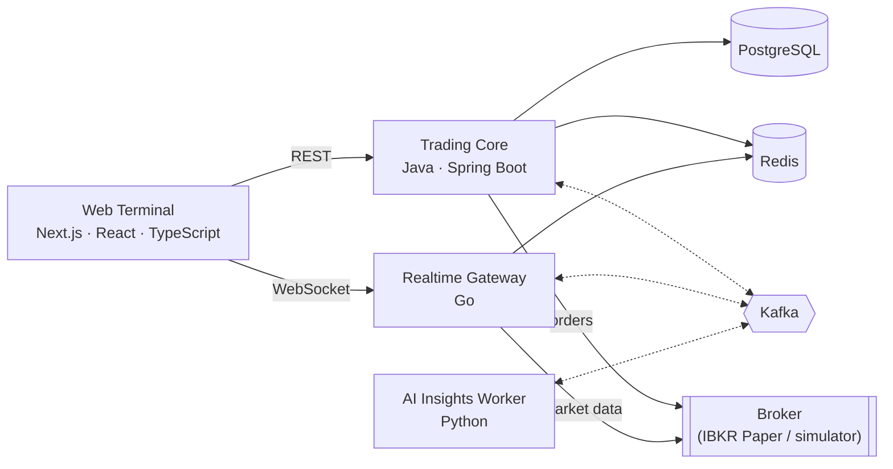

# Real-Time Trading Terminal

A single-page, realtime stock trading terminal with live quotes, live candlestick charts, and paper order execution, built on an event-driven backend.

> **Status: under active development.** The services are being built incrementally. Setup instructions, screenshots, and benchmark results will be added here as each part becomes runnable. Only measured results will be published.

## What it does

- **Live market data:** a watchlist with bid, ask, last, volume, change and change %, streamed over WebSocket, with a visible connection state (`LIVE` / `RECONNECTING` / `STALE` / `DISCONNECTED`). Stale prices are never shown as live.
- **Charting:** candlesticks with historical bars and live updates to the current candle, a crosshair, and an interval selector.
- **Trading:** Buy, Sell and Short orders, market and limit order types, open orders, cancellation, and the full order lifecycle, including broker confirmation prompts.
- **Portfolio:** positions, average cost, market value, realized and unrealized P&L, and account metrics. Any metric the broker doesn't provide is shown as *Unavailable*, never estimated.
- **News:** financial news per symbol, optionally enriched with AI-generated summaries, sentiment and catalysts.

## Runtime modes

| Mode | Purpose |
|---|---|
| `MOCK` | A deterministic market and broker simulator. It needs no credentials and is the only mode used for public demos. |
| `IBKR_PAPER` | Integration with an Interactive Brokers **paper trading** account, for trusted private environments only. |

There is no live-money trading.

## Architecture

| Component | Responsibility |
|---|---|
| **Web Terminal** (Next.js) | The trading UI. It never talks to the broker and holds no secrets. |
| **Trading Core** (Spring Boot) | The system of record for trading: order validation and lifecycle, idempotent order submission, positions and P&L, watchlist, news ingestion, transactional outbox, and reconciliation against the broker |
| **Realtime Gateway** (Go) | Broker session and streaming, quote normalization, per-symbol coalescing and backpressure, browser WebSocket fanout, historical bars |
| **AI Insights Worker** (Python) | Asynchronous news enrichment with schema-validated LLM output. It is isolated from trading and cannot place, modify, or cancel orders. |
| **PostgreSQL** | Durable application state |
| **Redis** | Disposable hot state and caches, all with TTLs |
| **Kafka** | Durable asynchronous domain events (orders, executions, broker updates, news) |

### Engineering principles

- **Critical and non-critical paths are separated.** Trading and live quotes never depend on AI, news, or observability.
- **Quotes take a fast path** from broker to gateway to WebSocket to browser. They never go through Kafka or the database.
- **No lost events:** state changes and their events are committed atomically (transactional outbox). Consumers are idempotent, and delivery is at-least-once.
- **No duplicate orders:** order submission is idempotent through `Idempotency-Key`, and orders are never retried automatically.
- **Exact money math:** decimal arithmetic end to end. Prices travel as decimal strings. All timestamps are UTC.
- **Bounded everything:** every queue, buffer, and retry has a limit. Every network call has a timeout, and every external provider is rate-limited.
- **Ports and adapters:** broker and market-data integrations sit behind interfaces, so the simulator and IBKR paper adapters are interchangeable.

## Technology

Java · Spring Boot · Go · Python · TypeScript · Next.js · React · PostgreSQL · Redis · Apache Kafka (KRaft) · OpenTelemetry · Prometheus · Grafana · Docker Compose

## Getting started

Local setup instructions will be published here together with the Docker Compose environment.

## Security

See [SECURITY.md](SECURITY.md). Public deployments run in `MOCK` mode only. Broker credentials never reach the browser, the repository, or logs.

## License

Proprietary: available for viewing and evaluation only. See [LICENSE](LICENSE).
